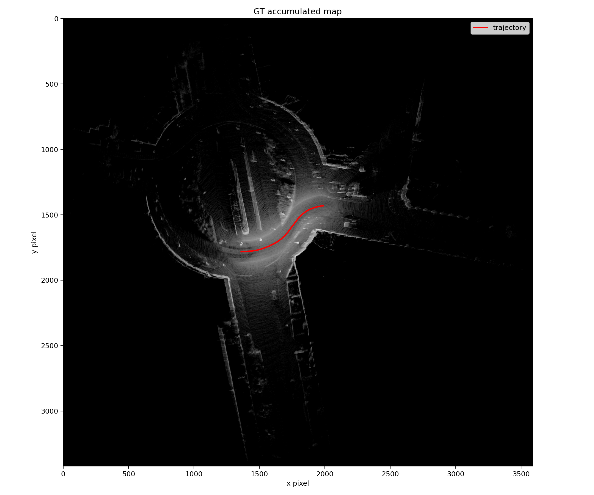
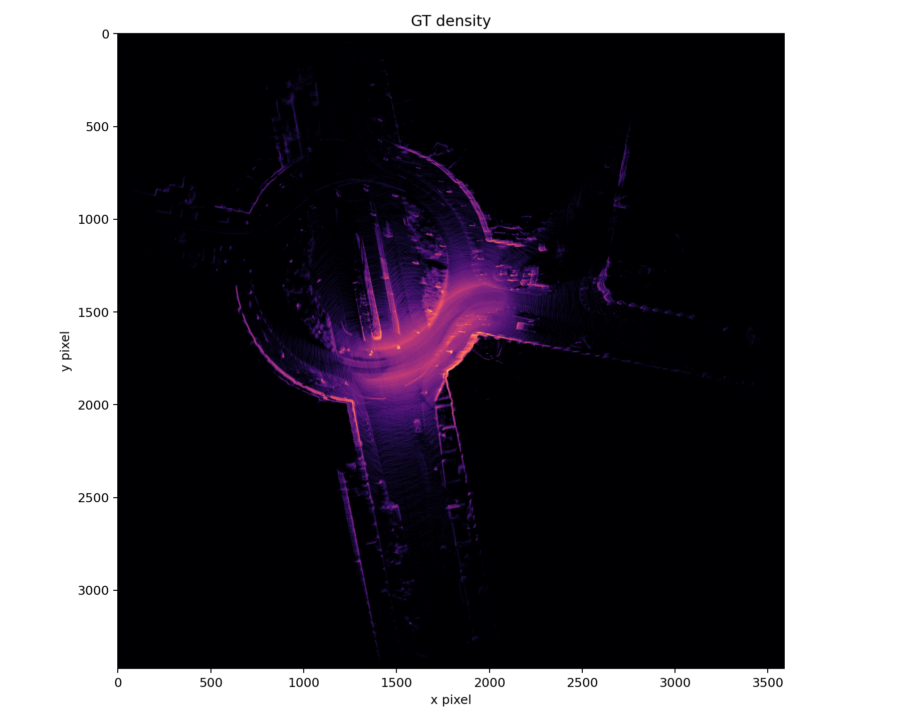
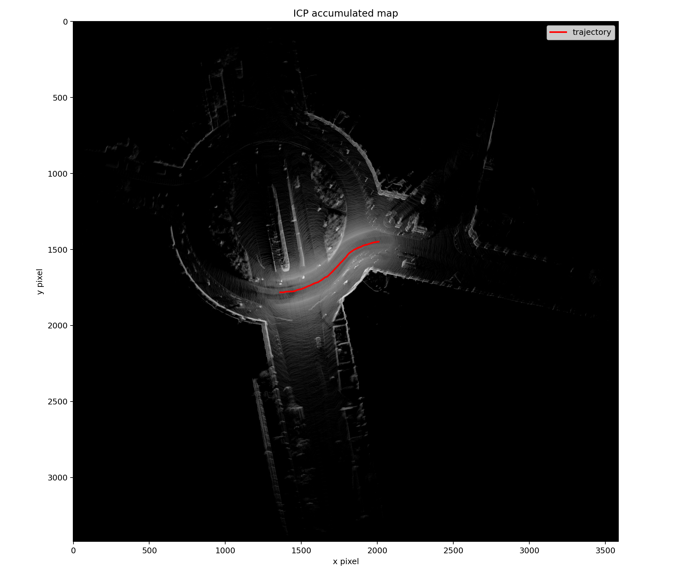
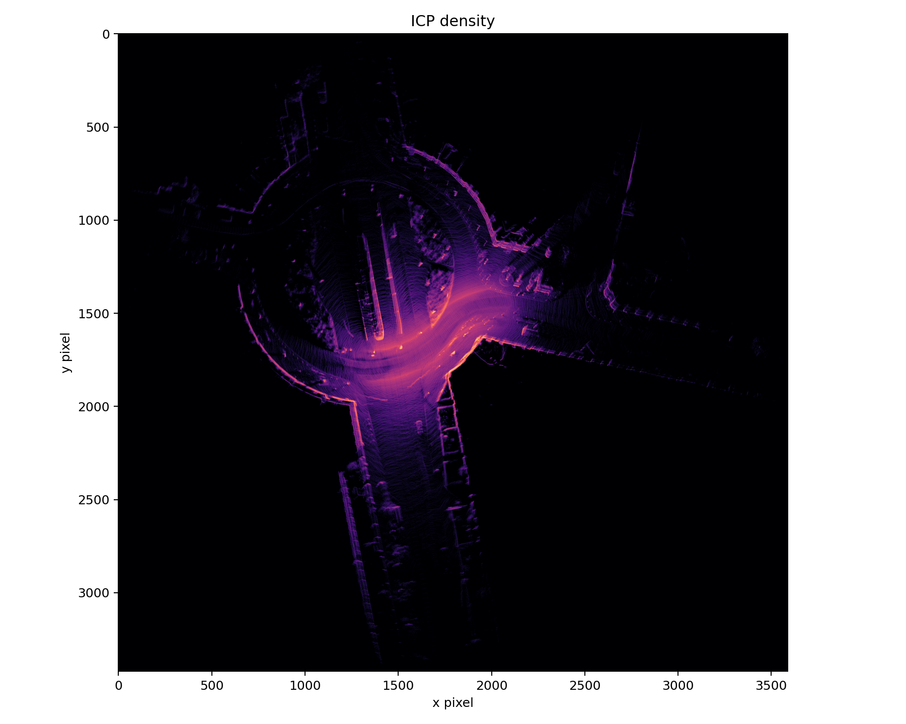
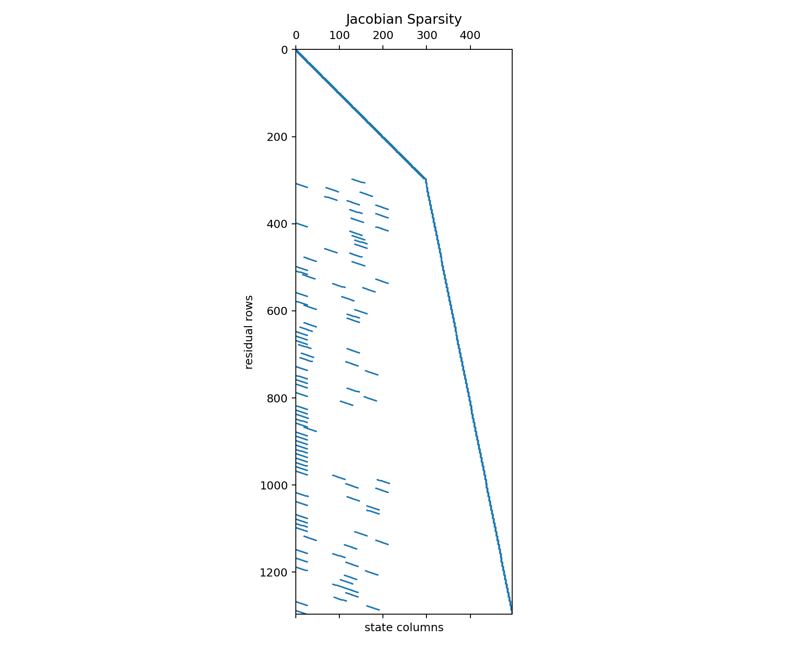
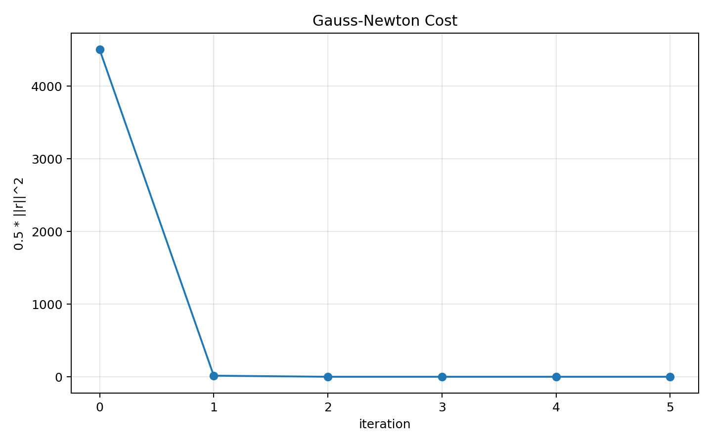
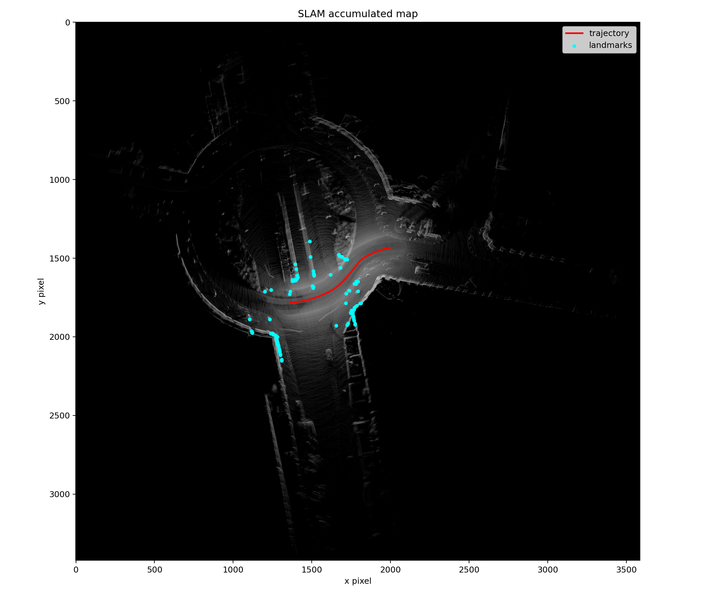
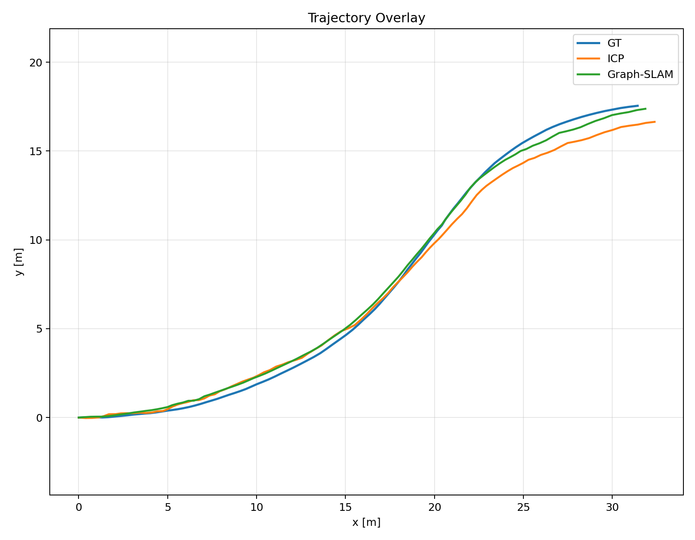
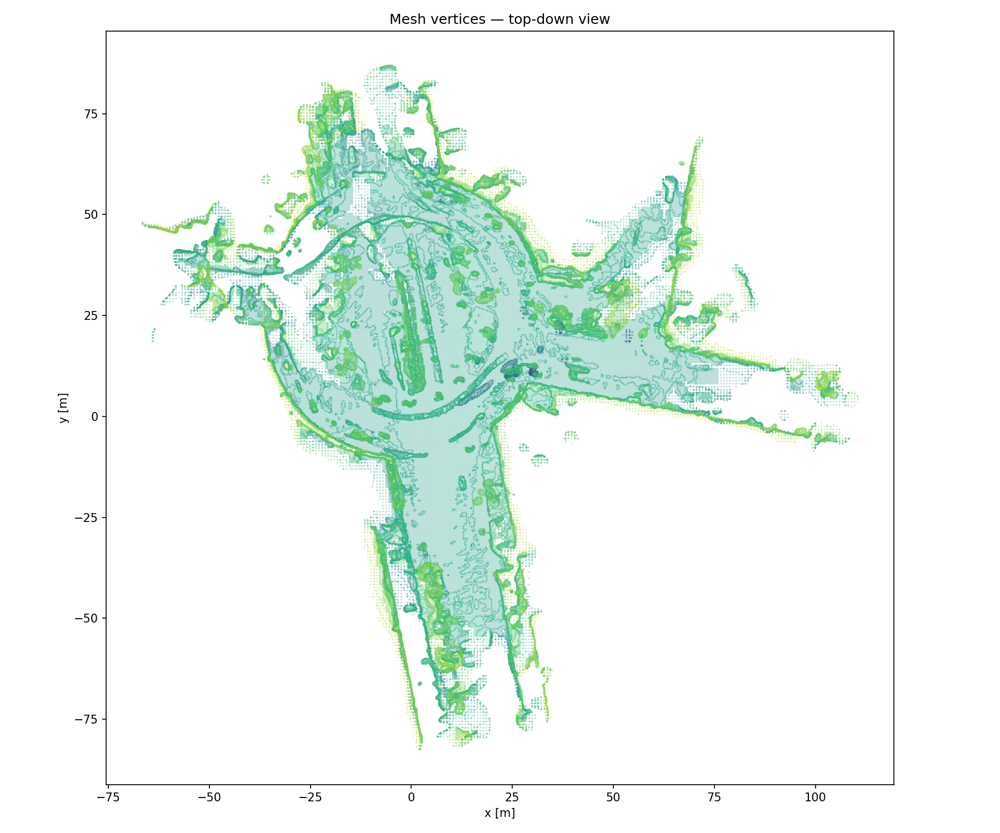
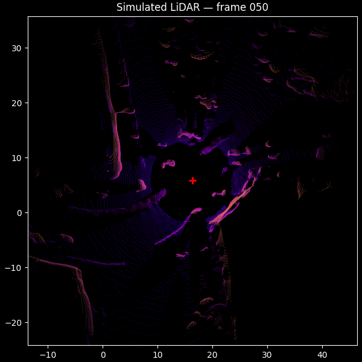

# KITTI Graph-SLAM

LiDAR SLAM (Simultaneous Localization and Mapping) on the [KITTI Raw dataset](http://www.cvlibs.net/datasets/kitti/raw_data.php). Implements two approaches: **ICP odometry** (pose chaining via pairwise point cloud registration) and **Graph-SLAM** (joint trajectory + landmark optimization using Gauss-Newton).

---

## Tasks

### Task 0 — Ground Truth Map Accumulation

Accumulates 100 LiDAR scans into a single world-frame point cloud using ground truth poses, then rasterizes it to a top-down occupancy map at 0.05 m/pixel resolution.

| Ground Truth Map | GT Point Density |
|---|---|
|  |  |

### Task 1 — ICP Odometry (Pose Chaining)

Builds a trajectory by running pairwise ICP between consecutive LiDAR frames (Open3D point-to-point, voxel size 0.25 m, max correspondence 1.5 m, 60 iterations). Relative transforms are chained in SE(2) to form a global trajectory.

**Key insight**: ICP returns `T_{t+1 ← t}`. The world-frame pose of frame `t+1` is:
```
T_{world ← t+1} = T_{world ← t} @ inv(T_{t+1 ← t})
```

Accumulated odometry drift causes ~0.68 m ATE RMSE over 100 frames.

| ICP Odometry Map | ICP Point Density |
|---|---|
|  |  |

### Task 2 — Graph-SLAM with Gauss-Newton

Jointly optimizes all poses and landmark positions by minimizing a factor graph energy:

```
E_total = Σ_t ||r_motion(x_t, x_{t+1}, u_t)||²_R  +  Σ_{t,j} ||r_obs(x_t, m_j, z_tj)||²_Q
```

where `R = diag(0.24, 0.24, 0.04)` (motion noise) and `Q = diag(0.08, 0.08)` (distance observation noise).

#### Task 2.1 — Motion Residual and Analytical Jacobians

SE(2) forward kinematics and residual:
```
f(x_i, T_ji) = [x_i + cos(θ_i)·dx − sin(θ_i)·dy,
                y_i + sin(θ_i)·dx + cos(θ_i)·dy,
                θ_i + dθ]

r = x_j − f(x_i, T_ji)
```

Analytical Jacobians (3×3 each):
```
J_i = [[-1,  0,   dx·sin(θ_i) + dy·cos(θ_i)],
       [ 0, -1,  -dx·cos(θ_i) + dy·sin(θ_i)],
       [ 0,  0,  -1                          ]]

J_j = I₃
```



#### Task 2.2 — Gauss-Newton Solver

Iterative nonlinear least-squares:
1. Build sparse Jacobian `J` and residual `r` from all factors
2. Normal equations: `A = Jᵀ J`, `b = −Jᵀ r`
3. Levenberg-Marquardt damping: `A += λI` (`λ = 1e-6`)
4. Solve: `(A + λI) Δx = b`
5. Update state, early-stop when relative cost change < `1e-6`

Converges in **6 iterations**, cutting ATE RMSE from 0.68 m to **0.33 m**.



| Graph-SLAM Map | Trajectory Comparison |
|---|---|
|  |  |

### Extra Credit — Mesh Reconstruction and LiDAR Simulation

Reconstructs a 3D mesh from the accumulated point cloud using Open3D Poisson surface reconstruction, then ray-casts simulated LiDAR scans on the mesh.

| Mesh | Simulated LiDAR Sample |
|---|---|
|  |  |

---

## Results

| Method | ATE RMSE |
|---|---|
| ICP Odometry | 0.6823 m |
| **Graph-SLAM** | **0.3252 m** |

Full metrics: [`outputs/metrics/metrics.json`](outputs/metrics/metrics.json)

```json
{
  "sequence": "2011_09_26_drive_0005_sync",
  "num_frames": 100,
  "num_landmarks": 100,
  "ate_icp_rmse": 0.6823,
  "ate_slam_rmse": 0.3252,
  "gn_iters": 6
}
```

---

## Setup

```bash
conda create -n cs588 python=3.11.0
conda activate cs588
pip install -r requirements.txt
```

## Data

Download the same KITTI raw data as MP0 (requires UIUC login) and place it under `data/`:

```
data/
└── kitti_raw/
    └── 2011_09_26/
        ├── 2011_09_26_drive_0005_sync/
        │   ├── disp_02/
        │   ├── image_00/ ... image_03/
        │   ├── oxts/
        │   ├── tracklet_labels.xml
        │   └── velodyne_points/
        ├── calib_cam_to_cam.txt
        ├── calib_imu_to_velo.txt
        └── calib_velo_to_cam.txt
```

## Running

```bash
# Task 0: Accumulate ground truth map
python run.py gt_align

# Task 1: ICP odometry chaining
python run.py icp

# Task 2: Full Graph-SLAM (runs all tasks)
python run.py all
```

## File Overview

| File | Description |
|---|---|
| `icp.py` | Pairwise ICP and SE(2) pose chaining (Task 1) |
| `graph_slam.py` | Gauss-Newton SLAM solver and linear system builder (Task 2.2) |
| `slam_factors.py` | Motion residual/Jacobians and distance factor (Task 2.1) |
| `alignment.py` | Map accumulation and rasterization helpers (Task 0) |
| `run.py` | Main entry point — orchestrates all tasks |
| `utils/geometry_utils.py` | SE(2)/SE(3) conversions, angle normalization |
| `utils/kitti_utils.py` | KITTI dataset loading and calibration parsing |
| `utils/mapping_utils.py` | Point cloud filtering, voxelization, occupancy maps |
| `utils/metrics_utils.py` | ATE RMSE and trajectory evaluation |
| `utils/viz_utils.py` | Map and trajectory visualization |

## Dependencies

- `open3d` — point cloud processing and ICP
- `numpy`, `scipy` — linear algebra
- `pykitti` — KITTI dataset loader
- `matplotlib` — map and trajectory plotting

## Dataset

KITTI Raw `2011_09_26_drive_0005_sync` — 100 frames, ~121K static LiDAR points per frame, 100 landmarks estimated.

| Parameter | Value |
|---|---|
| Map resolution | 0.05 m/pixel |
| ICP voxel size | 0.25 m |
| ICP max correspondence | 1.50 m |
| SLAM sigma_xy / sigma_theta | 0.24 / 0.04 |
| SLAM sigma_d (landmark) | 0.08 |
